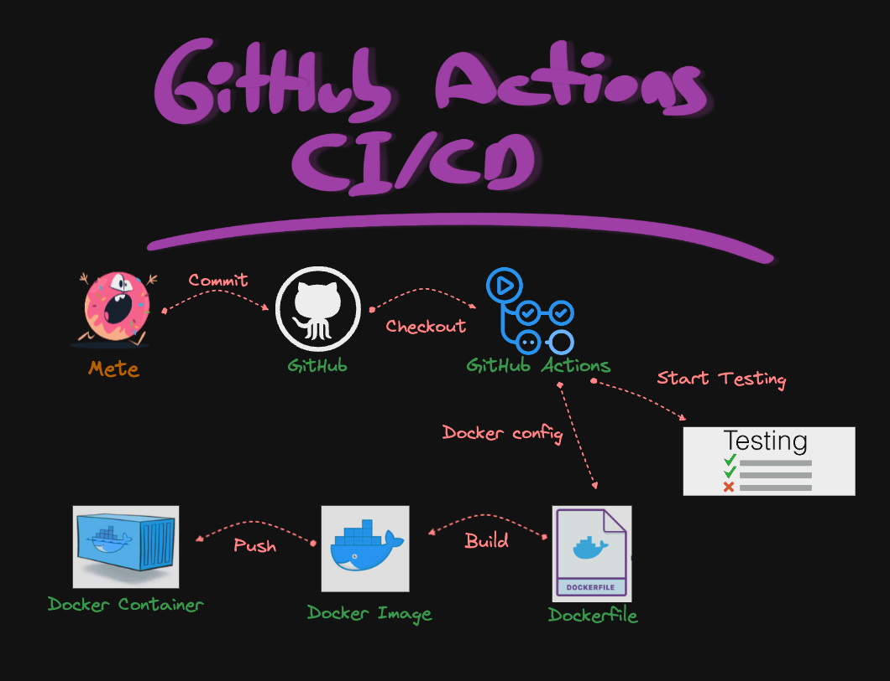

# ci-cd-github-actions-demo

## Icerik
- [Best GitHub Actions documentation](#best-github-actions-documentation)
- [GitHub Actions nedir?](#github-actions-nedir)
- [GitHub Actions CI/CD temel terminoloji ve kavramlar nelerdir?](#github-actions-cicd-temel-terminoloji-ve-kavramlar-nelerdir)
- [CI/CD'nin faydalari ve zorluklari](#cicdnin-faydalari-ve-zorluklari)
- [Basit Terimlerle Aciklanan CI/CD Sureci](#basit-terimlerle-aciklanan-cicd-sureci)
- [Secret_Key Ekleme](#secret-key-ekleme)
- [Docker Hub'a gonderdigimiz imaji calistirmak adimlari](#docker-huba-gonderdigimiz-imaji-calistirmak-adimlari)
- [Local Build & Run](#local-build--run)
- [Tech Stack](#tech-stack)
- [Requirements](#requirements)
- [Kaynakca](#kaynakca)

## Best GitHub Actions documentation 
    https://docs.github.com/actions

## GitHub Actions nedir?
Yazilim gelistirme sureclerini otomatiklestirmek ve yonetmek icin kullanilir. GitHub Actions, CI (Continuous Integration - Surekli Entegrasyon), CD (Continuous Deployment/Continuous Delivery - Surekli Dagitim/Surekli Teslimat) gibi surecleri kolaylastirmak icin kullanicilarin belirli olaylara veya zamanlamalara bagli olarak belirli eylemler gerceklestirmesine olanak tanir. Bu eylemler, kodu derleme, test etme, paket olusturma, dagitim yapma gibi islemleri icerebilir.

<p align="center">
    
</p>

<p align="center">
    
</p>


## GitHub Actions CI/CD temel terminoloji ve kavramlar nelerdir?

`1. CI (Continuous Integration - Surekli Entegrasyon)`<br> CI, gelistirme surecinde kodun otomatik olarak derlenip birlestirilmesini ve test edilmesini saglayan bir yontemdir. Bu, kod tabanindaki degisikliklerin birlestirilerek catismalarin erken tespit edilmesini ve hatalarin azaltilmasini saglar.

`2. CD (Continuous Deployment/Continuous Delivery - Surekli Dagitim/Surekli Teslimat)`<br> CD, yazilimin otomatik olarak test edilmesi ve gerektiginde canliya hizli ve guvenilir bir sekilde dagitilmasini saglayan bir surectir. Surekli Dagitim, kod tabanindaki her degisikligi otomatik olarak canliya dagitmayi icerirken, Surekli Teslimat, kod tabanindaki degisikliklerin istenildiginde otomatik olarak dagitilmaya hazir oldugu anlamina gelir.

`3. Workflow`<br> GitHub Actions'ta bir is akisi, belirli bir olay veya tetikleyiciye bagli olarak calisan bir dizi islem veya eylem iceren bir otomasyon surecidir. Is akislari, projenin ihtiyaclarina ve gereksinimlerine gore ozellestirilebilir.

`4. Action`<br> GitHub Actions'ta bir eylem, is akislari icindeki temel yapi tasidir. Eylemler, belirli bir gorevi gerceklestirmek icin kullanilir. Ornegin, kod derleme, test calistirma, paket olusturma, dagitim gibi gorevler eylemler araciligiyla gerceklestirilebilir.

`5. Runner`<br> GitHub Actions is akislarinin calistirildigi sanal ortamlardir. Runner'lar, is akislarinin calistirilmasi icin gereken kaynaklari saglar. GitHub'ta barindirilan calistiricilar oldugu gibi kendi kendinize barindirabileceginiz ozellestirilmis calistiricilar da bulunmaktadir.

`6. Event`<br> GitHub Actions is akislarinin tetikleyicisi olan olaylardir. Ornegin, kodun bir dalina yapilan push olayi, bir pull request, bir zamanlama veya baska bir GitHub olayi bir is akisini tetikleyebilir.

<p align="center">
    
</p>

## CI/CD'nin faydalari ve zorluklari
### Faydalari:

1. ` Hizli Geri Bildirim:` Degisikliklerin hizli bir sekilde test edilmesi ve geri bildirim alinmasi, hatalarin erken tespit edilmesini ve giderilmesini saglar.
2. ` Surekli Entegrasyon:` Surekli birlestirme sureci, yazilimin surekli olarak guncel ve calisir durumda olmasini saglar. Bu, gelistirme ekibinin birbirine cakisan degisiklikleri yonetmesini kolaylastirir.
3. ` Kalite Guvencesi:` Otomatik testlerin ve surekli kontrolun olmasi, yazilim kalitesini artirir ve hatalarin erken tespit edilmesini saglar.
4. ` Hizli Dagitim:` Dogrulanmis degisikliklerin hizli bir sekilde canli ortama dagitilmasi, yeni ozelliklerin ve duzeltmelerin hizla kullanicilarla paylasilmasini saglar.
5. ` Maliyet ve Zaman Tasarrufu:` Otomatiklestirilmis surecler, gelistirme ekibinin tekrarlayan islemlerle zaman kaybetmesini onler ve maliyet tasarrufu saglar.
6. ` Surekli Iyilestirme:` Surekli geri bildirim alarak ve surecleri otomatiklestirerek surekli olarak gelistirme surecini iyilestirir.


### Zorluklari:

1. ` Karmasik Yapilandirma:` Bazi karmasik projelerde CI/CD sureclerini dogru bir sekilde yapilandirmak zor olabilir.
2. ` Veri Guvenligi:` Hassas verilerin otomatik olarak islenmesi ve dagitilmasi, guvenlik riskleri dogurabilir ve ozel verilerin korunmasini zorlastirabilir.
3. ` Yuksek Baslangic Maliyeti:` CI/CD altyapisinin olusturulmasi ve yonetilmesi, baslangicta yuksek maliyetler ve zaman gerektirebilir.
4. ` Entegrasyon Zorluklari:` Bazi karmasik sistemlerde CI/CD'nin diger sureclerle entegrasyonu zor olabilir.
5. ` Egitim Gereksinimi:` Ekibin CI/CD sureclerini anlamasi ve etkin bir sekilde kullanmasi icin egitim gerekebilir.
6. ` Buyuk Olcekli Projelerde Yonetim Zorluklari:` Buyuk olcekli projelerde CI/CD sureclerini yonetmek ve koordine etmek zor olabilir.


## Basit Terimlerle Aciklanan CI/CD Sureci
    !!! ByteByteGo yazisinin turkce cevirisi.
### Bolum 1 - CI/CD ile SDLC
Yazilim gelistirme yasam dongusu (SDLC), gelistirme, test, dagitim ve bakim gibi birkac temel asamadan olusur. CI/CD bu asamalari otomatiklestirir ve entegre ederek daha hizli ve guvenilir surumler saglar.
Kod bir git deposuna gonderildiginde, otomatik bir derleme ve test sureci tetiklenir. Uctan uca (e2e) test durumlari kodu dogrulamak icin calistirilir. Testler basarili olursa, kod otomatik olarak staging/production ortamlarina dagitilabilir. Sorunlar bulunursa, kod geri gonderilir ve gelistirme asamasinda hata duzeltme islemine alinir. Bu otomasyon, gelistiricilere hizli geri bildirim saglar ve uretimde hata riskini azaltir.

### Bolum 2 - CI ve CD Arasindaki Fark
Surekli Entegrasyon (CI), derleme, test ve birlestirme surecini otomatiklestirir. Kod her gonderildiginde entegrasyon sorunlarini erken tespit etmek icin testleri calistirir. Bu,  kod gonderimlerini tesvik eder ve hizli geri bildirim saglar.

Surekli Dagitim (CD), altyapi degisiklikleri ve dagitim gibi yayin sureclerini otomatiklestirir. CD, yazilimin otomatik is akislariyla herhangi bir zamanda guvenilir bir sekilde yayinlanabilecegini saglar. CD ayrica, uretim dagitimindan once gereken manuel test ve onay adimlarini da otomatiklestirebilir.

### Bolum 3 - CI/CD Sureci
Tipik bir CI/CD surecinde birkac baglantili asama bulunur:

Gelistirici, kod degisikliklerini kaynak kontrolune gonderir
CI sunucusu degisiklikleri algilar ve derlemeyi tetikler
Kod derlenir, test edilir (birim, entegrasyon testleri)
Test sonuclari gelistiriciye raporlanir
Basarili olunursa, urunler staging ortamlarina dagitilir
Yayin oncesinde staging uzerinde daha fazla test yapilabilir
CD sistemi onaylanan degisiklikleri uretime dagitir

<p align="center">
    
</p>


## Secret Key Ekleme:


## Docker Hub'a gonderdigimiz imaji calistirmak adimlari:

1. Docker Hub'dan proje imajini cekin:
   ```shell
   docker pull mgmetehanx/githubactions:latest 
   ```

2. Docker uzerinde imaji calistirin:
   ```shell
   docker run -p 8088:8088 mgmetehanx/githubactions:latest
   ```

3. Asagidaki komutu kullanarak API'ye POST istegi gonderin:
   ```shell
    curl -X POST -H "Content-Type: application/json" -d '{
    "name": "test",
    "price": 1,
    "brand": "test",
    "category": "test"
    }' http://localhost:8088/api/v1/items   
    ```

## Local Build & Run
```shell
  docker build . -t githubactionsdemo
```
```shell
  docker images
```
```shell
  docker run -p 8088:8088 -t githubactionsdemo
```


## Tech Stack

- Java 17
- Spring Boot 3.0
- Docker
- Lombok
- H2


## Requirements

For building and running the application you need:

- [JDK 17 or newer](https://www.oracle.com/java/technologies/javase-downloads.html)
- [Maven](https://maven.apache.org)
- [Lombok](https://projectlombok.org/)
- [Docker](https://www.docker.com/)
- [H2](https://www.h2database.com/html/main.html)


## Kaynakca:
- https://www.youtube.com/watch?v=eMrOMD6HgDg&ab_channel=H%C3%BCseyinBABAL
- https://www.youtube.com/watch?v=R8_veQiYBjI&ab_channel=TechWorldwithNana
- https://www.linkedin.com/pulse/testing-java-apps-junit-github-actions-emad-mohamed/
- https://programmingpercy.tech/blog/github-actions-in-action/
- https://youtu.be/sDZ6aHyAz2g?si=tYiOuMXXIf4TOTNt
- https://kadermiyanyedi.medium.com/github-actions-nedir-f61a77b49c23
- https://www.atomicjar.com/2023/06/running-testcontainers-tests-using-github-actions/
- https://dev.to/rubyshiv/how-to-deploy-springboot-app-to-elastic-beanstalk-using-github-actions-cicd-2ihi
- https://github.com/docker/login-action
- https://github.com/actions/cache
- https://github.com/marketplace/actions/build-and-push-docker-images
